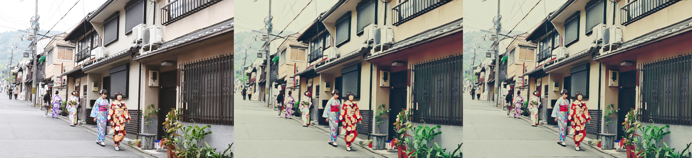

## Implementation of [AnimeGANv2](https://github.com/TachibanaYoshino/AnimeGANv2)


## Samples

Results from converted `Paprika` style model 

(**Left-Right**: input image, original tensorflow result, pytorch result)

 &nbsp; 
 &nbsp; 
 &nbsp; 


## Basic Usage

### Local

**Setup**
```sh
git clone https://github.com/ATESAM-ABDULLAH/AnimeGAN2.git
cd AnimeGAN2
pip install -r requirements.txt
```

**Inference**
```sh
python test.py --input_dir [image_folder_path] --output_dir [image_folder_path] --device [cpu/cuda]
```

### Colab
You can try `AnimeGANv2` in Google Colab by copying and pasting this code.

For accelerated inference, you can use a GPU. Simply select `Runtime` > `Change runtime type` and select `T4 GPU` in the `Hardware Acceleration` dropdown.

```python
from io import BytesIO
import torch
from PIL import Image

import ipywidgets as widgets
import IPython.display as display
from google.colab import files

# Check for GPU availability and set device accordingly
device = "cuda" if torch.cuda.is_available() else "cpu"
print(f"Using device: {device}")  # Print device information

# Load pre-trained models from the provided hub
model = torch.hub.load("bryandlee/animegan2-pytorch:main", "generator", device=device).eval()
face2paint = torch.hub.load("bryandlee/animegan2-pytorch:main", "face2paint", device=device)

# Define image format for saving output (user can adjust via param)
image_format = "png"  # @param ["jpeg", "png"]

# Create button to trigger image processing
button = widgets.Button(description="Start")
output = widgets.Output()  # Create an output area for displaying results


def run(b):
    # Disable button to prevent multiple clicks
    button.disabled = True

    # Clear any previous output before processing
    with output:
        display.clear_output()

    # Upload image using Colab's file uploader
    uploaded = files.upload()

    for fname in uploaded:
        # Read uploaded image data as bytes
        bytes_in = uploaded[fname]

        # Open image from bytes using Pillow library
        im_in = Image.open(BytesIO(bytes_in)).convert("RGB")  # Convert to RGB mode

        # Process image using the face2paint model
        im_out = face2paint(model, im_in, side_by_side=False)

        # Create a BytesIO buffer for saving the output image
        buffer_out = BytesIO()
        im_out.save(buffer_out, format=image_format)  # Save image in chosen format
        bytes_out = buffer_out.getvalue()

        # Create widgets to display original and processed images
        wi1 = widgets.Image(value=bytes_in, format=image_format)
        wi2 = widgets.Image(value=bytes_out, format=image_format)

        # Set max width and height for image widgets
        wi1.layout.max_width = '500px'
        wi1.layout.max_height = '500px'
        wi2.layout.max_width = '500px'
        wi2.layout.max_height = '500px'

        # Create a horizontal layout to display images side-by-side
        sidebyside = widgets.HBox([wi1, wi2])

        # Display the processed images within the output area
        with output:
            display.display(sidebyside)

    # Re-enable button after processing is complete
    button.disabled = False

# Connect button click to the run function
button.on_click(run)

# Display the button and output area in the notebook
display.display(button, output)

```
