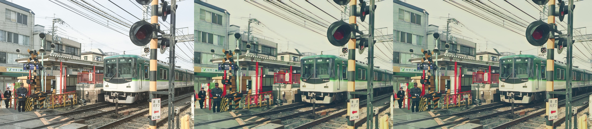

## Implementation of [AnimeGANv2](https://github.com/TachibanaYoshino/AnimeGANv2)


## Samples

Results from converted `Paprika` style model 

(**Left-Right**: input image, original tensorflow result, pytorch result)

 &nbsp; 
 &nbsp; 
 &nbsp; 


## Basic Usage

### Local

**Setup**
```sh
git clone https://github.com/ATESAM-ABDULLAH/AnimeGAN2.git
cd AnimeGAN2
pip install -r requirements.txt
```

**Inference**
```sh
python test.py --input_dir [image_folder_path] --output_dir [image_folder_path] --device [cpu/cuda]
```

### Colab
You can try `AnimeGANv2` in Google Colab by pasting this code:

```python
from io import BytesIO
import torch
from PIL import Image

import ipywidgets as widgets
import IPython.display as display
from google.colab import files

device = "cuda" if torch.cuda.is_available() else "cpu"
model = torch.hub.load("bryandlee/animegan2-pytorch:main", "generator", device=device).eval()
face2paint = torch.hub.load("bryandlee/animegan2-pytorch:main", "face2paint", device=device)
image_format = "png" #@param ["jpeg", "png"]

button = widgets.Button(description="Start")
output = widgets.Output()


def run(b):
    button.disabled = True

    with output:
        display.clear_output()
    
    uploaded = files.upload()

    for fname in uploaded:
        bytes_in = uploaded[fname]

        im_in = Image.open(BytesIO(bytes_in)).convert("RGB")
        im_out = face2paint(model, im_in, side_by_side=False)
        buffer_out = BytesIO()
        im_out.save(buffer_out, format=image_format)
        bytes_out = buffer_out.getvalue()
        wi1 = widgets.Image(value=bytes_in, format=image_format)
        wi2 = widgets.Image(value=bytes_out, format=image_format)
        wi1.layout.max_width = '500px'
        wi1.layout.max_height = '500px'
        wi2.layout.max_width = '500px'
        wi2.layout.max_height = '500px'

        ## Side by side thanks to HBox widgets
        sidebyside = widgets.HBox([wi1, wi2])
        ## Finally, show.
        with output:
            display.display(sidebyside)
    
    button.disabled = False

button.on_click(run)
display.display(button, output)
```
